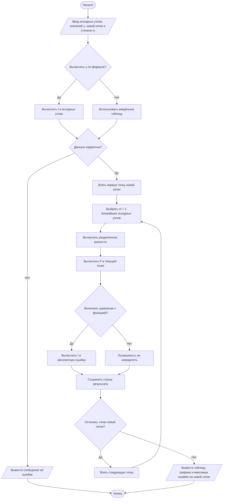
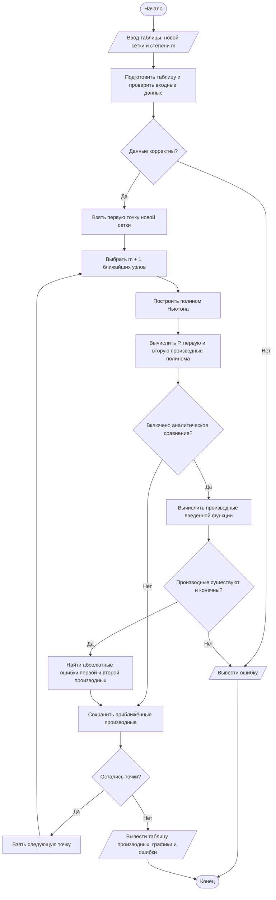
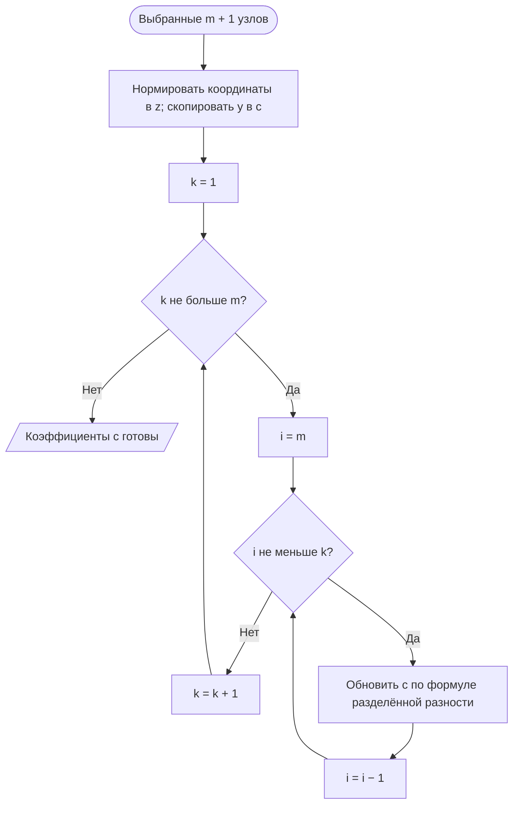
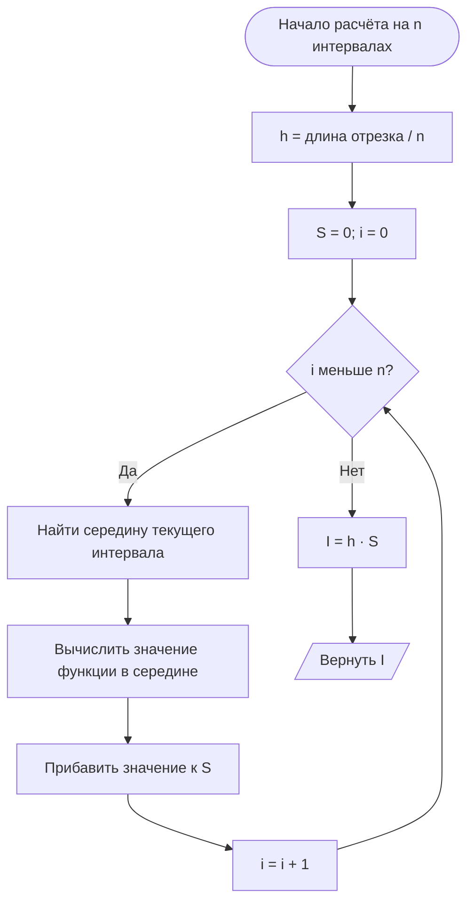
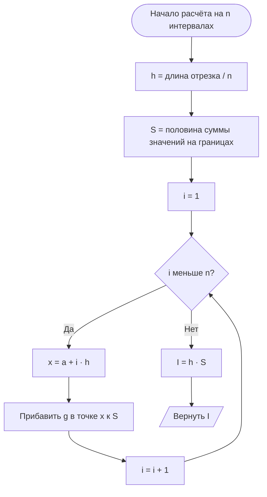
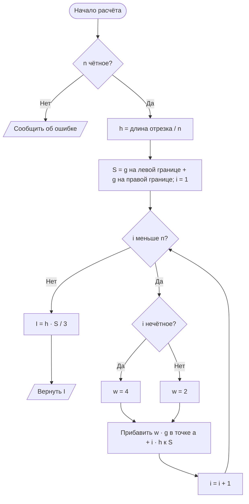
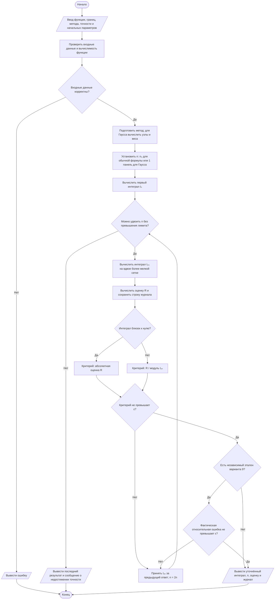
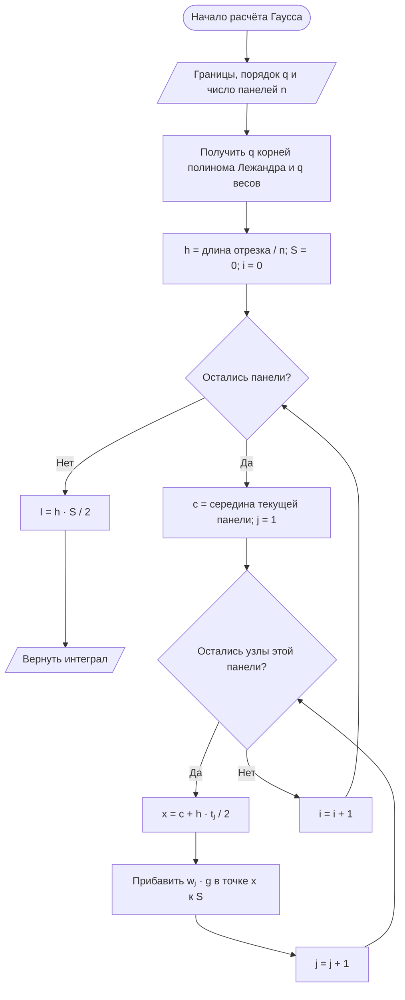

# Как работают методы: вариант 9 и блок-схемы

Этот документ объясняет задания **6.3, 6.4 и 6.5** простыми словами, а затем показывает алгоритмы, реализованные в программе.

Условия взяты из [методических указаний КР/ЛР](Вычислительная%20математика_КР_ЛР_2019.pdf), с. 102–106. Теория — из [учебного пособия](Вычислительные%20методы%20-%20пособие.pdf), главы 7–9. Номера заданий относятся к КР/ЛР: в учебном пособии нумерация глав другая.

Блок-схемы записаны на **Mermaid** внутри Markdown. Они отображаются как рисунки в просмотрщиках с поддержкой Mermaid, например в GitHub. Если вместо рисунка виден код `flowchart`, текущий просмотрщик не поддерживает Mermaid. Скруглённые блоки обозначают начало и конец, параллелограммы — ввод и вывод, прямоугольники — вычисления, ромбы — проверки условий.

## 1. Что вообще нужно сделать

| Задание | Вопрос, на который отвечает метод | Что получаем |
| --- | --- | --- |
| 6.3. Интерполяция | Знаем несколько точек. Как найти значение между ними? | Полином P(x), значения на новой сетке и ошибки |
| 6.4. Дифференцирование | Как быстро меняется функция? Как меняется её наклон? | Приближения первой и второй производных |
| 6.5. Интегрирование | Какова суммарная площадь под графиком на отрезке? | Число — приближённое значение интеграла |

Для положительной функции интеграл действительно равен площади между графиком и осью x. Если функция бывает отрицательной, участки ниже оси дают отрицательный вклад: получается **площадь с учётом знака**.

В заданиях 6.3 и 6.4 используется:

```text
f(x) = √x + 1,   x от 1 до 2.
```

В 6.5 используется **другая функция**:

```text
g(x) = 1 / (√(1 − x²) · √(1 + x²)),   x от −0,75 до 0,75.
```

Здесь она обозначена буквой g, чтобы не путать её с функцией первых двух заданий. В интерфейсе обе обозначаются f(x), каждая на своей вкладке.

## 2. Что означают буквы и две сетки

**Узел** — это выбранная точка x. **Сетка** — набор таких точек. В таблице у каждого узла есть значение y = f(x).

| Обозначение | Значение |
| --- | --- |
| f(x) | Исходная функция |
| xᵢ, yᵢ | Исходные узлы и известные значения в них |
| h = 0,1 | Шаг исходной сетки в 6.3 и 6.4 |
| xⱼ | Узлы новой сетки, где нужно получить ответ |
| Pₘ(x) | Полином, построенный по исходной таблице |
| m | Степень полинома; для него берём m + 1 узел |
| Δ | Абсолютная погрешность, например |P(x) − f(x)| |
| a, b | Нижний и верхний пределы интеграла |
| n | Число интервалов интегрирования; узлов равномерной сетки n + 1 |
| ε | Требуемая точность |

### Почему h = 0,1, а в программе есть 0,05

В задании явно заданы две сетки:

```text
Исходная: xᵢ = 1 + i·h,     h = 0,1,  i = 0…10.
Новая:    xⱼ = 1 + j·h/2,             j = 0…20.

Исходная: 1,00 ───────── 1,10 ───────── 1,20 ─── … ─── 2,00
Новая:    1,00 ── 1,05 ── 1,10 ── 1,15 ── 1,20 ─── … ─── 2,00
```

Получается **11 исходных точек** и **21 новая точка**. Шаг новой сетки равен h/2 = **0,05**. В исходных точках значения уже известны; между ними их предстоит восстановить.

Хотя в лабораторной работе формула f(x) известна, интерполяционный метод получает значения из **таблицы**. Формула нужна, чтобы заполнить таблицу и затем проверить, насколько хорошо метод восстановил функцию.

## 3. Задание 6.3: интерполяция Ньютона

### Идея: провести кривую через известные точки

Представьте несколько точек на бумаге. Через две точки можно провести прямую. Через три точки с разными x — единственную параболу степени не выше 2. Через четыре — единственный полином степени не выше 3.

**Интерполяция** строит такой полином, чтобы он проходил через выбранные исходные точки:

```text
P(xᵢ) = yᵢ.
```

Между исходными точками мы используем значение P(x) как приближение неизвестного значения f(x).

| Степень m | Сколько нужно точек | Вид полинома |
| --- | --- | --- |
| 1 | 2 | Прямая: a₀ + a₁x |
| 2 | 3 | Полином до x² |
| 3 | 4 | Полином до x³ |
| 10 | 11 | Полином до x¹⁰ |

По умолчанию в программе **m = 3**. Для каждой новой точки берутся **четыре ближайших исходных узла**. При переходе вдоль отрезка набор узлов может меняться — поэтому полином называют **скользящим**, или локальным. При равных расстояниях алгоритм предпочитает левый узел.

При m = 10 для варианта 9 используются все 11 исходных точек: получается один общий полином на всём отрезке. Повышение степени не гарантирует улучшение результата для любой функции: влияют расположение узлов, колебания полинома и округление.

### Пример вручную: прямая между двумя узлами

Чтобы понять принцип, временно возьмём степень **1**, а не установленную по умолчанию 3.

```text
x₀ = 1,0;   y₀ = √1,0 + 1 = 2.
x₁ = 1,1;   y₁ = √1,1 + 1 ≈ 2,048808848.

Нужно найти значение при x = 1,05.
```

Точка 1,05 находится ровно посередине. Для прямой её высота тоже находится посередине:

```text
P₁(1,05) = (y₀ + y₁)/2 ≈ 2,024404424.
```

Для проверки считаем исходную функцию:

```text
f(1,05) = √1,05 + 1 ≈ 2,024695077.

Δ = |P₁(1,05) − f(1,05)| ≈ 2,90653 × 10⁻⁴.
```

Это и есть результат интерполяции: мы взяли **два известных значения** и по ним получили **приближённое значение между узлами**.

### Что особенного в записи Ньютона

Один и тот же интерполяционный полином можно записать разными способами. В нашей программе используется форма Ньютона:

```text
Pₘ(x) = c₀
      + c₁(x − u₀)
      + c₂(x − u₀)(x − u₁)
      + …
      + cₘ(x − u₀)…(x − uₘ₋₁).
```

Буквой u здесь обозначены **выбранные для текущего полинома** исходные узлы.

Каждый следующий член добавляет возможность пройти ещё через одну точку. Например, множитель `(x − u₀)` равен нулю в первом узле, поэтому добавление второго члена не портит значение, уже установленное в первом узле.

Коэффициенты c вычисляются через **разделённые разности**:

```text
c₀ = y₀.

c₁ = (y₁ − y₀) / (u₁ − u₀).

d₀₁ = (y₁ − y₀) / (u₁ − u₀).
d₁₂ = (y₂ − y₁) / (u₂ − u₁).
c₂ = (d₁₂ − d₀₁) / (u₂ − u₀).
```

Первая разделённая разность — наклон прямой между двумя точками. Следующая описывает изменение этих наклонов. Для более высокой степени процесс повторяется.

Это **интерполяционная формула Ньютона**, а не метод Ньютона для поиска корней уравнения.

### Блок-схема 6.3



При проверке данных программа, в частности, убеждается, что исходные x строго возрастают, узлов достаточно для выбранной степени, а новая сетка лежит внутри исходного отрезка. При включённом аналитическом сравнении значения таблицы должны соответствовать выбранной функции.

### Почему P почти не отличается от f, а ошибка чередуется с нулём

P хорошо приближает f, поэтому линии на общем графике визуально накладываются друг на друга. Отдельный график ошибки показывает маленькую разницу в увеличенном масштабе.

В новой сетке каждая вторая точка совпадает с исходной:

| Новая точка | Исходный узел? | Что происходит с ошибкой |
| --- | --- | --- |
| 1,00 | Да | Ноль или очень маленькая ошибка округления |
| 1,05 | Нет | Ошибка приближения между узлами |
| 1,10 | Да | Ноль или очень маленькая ошибка округления |
| 1,15 | Нет | Ошибка приближения между узлами |

Поэтому график ошибки похож на чередование пиков и провалов. Это ожидаемое поведение интерполяции. Числа порядка **10⁻¹⁶** вместо нуля могут возникать из-за машинного округления.

## 4. Задание 6.4: первая и вторая производные

### Что означает производная

**Первая производная f′(x)** — наклон графика в точке, или скорость изменения функции:

- f′(x) > 0: функция возрастает;
- f′(x) < 0: функция убывает;
- чем больше модуль f′(x), тем круче график.

**Вторая производная f″(x)** показывает, как меняется этот наклон. Для `√x + 1` первая производная положительна, а вторая отрицательна: функция растёт, но всё медленнее.

### Как получить производные из таблицы

В таблице есть только значения функции, а производных нет. Поэтому программа действует так:

```text
Исходная таблица → полином P(x) → производные P′(x) и P″(x).
```

То есть сначала выполняется та же интерполяция, что в 6.3, затем **дифференцируется полученный полином**.

Например, если получился полином:

```text
P(x) = a₀ + a₁x + a₂x² + a₃x³,
```

то его производные вычисляются по обычным правилам:

```text
P′(x) = a₁ + 2a₂x + 3a₃x².
P″(x) = 2a₂ + 6a₃x.
```

Для варианта 9 известны производные исходной функции:

```text
f′(x)  = 1 / (2√x).
f″(x) = −1 / (4x√x).

Δ₁(x) = |P′(x) − f′(x)|.
Δ₂(x) = |P″(x) − f″(x)|.
```

**P′ и P″ — ответ численного метода. f′ и f″ — значения для проверки этого ответа.** При своей формуле программа получает проверочные производные автоматическим дифференцированием выражения: применяет правила суммы, произведения, частного и цепочки.

### Почему производные могут иметь ошибку даже в исходных узлах

Интерполяция заставляет полином совпасть с **высотой** исходной функции в узлах. Совпадение наклона при этом не требуется.

Две линии могут проходить через одну точку и иметь разные наклоны. Поэтому из `P(xᵢ) = f(xᵢ)` не следует `P′(xᵢ) = f′(xᵢ)`.

В примере с прямой между 1 и 1,1:

```text
P′₁(x) = (2,048808848… − 2) / 0,1 ≈ 0,488088482.
P″₁(x) = 0.
```

Наклон прямой постоянен, а наклон `√x + 1` меняется. Для полезного приближения второй производной этой функции нужна степень **не ниже 2**.

### Блок-схема 6.4



При использовании локальных полиномов набор исходных узлов меняется вдоль отрезка. В местах смены набора возможны небольшие скачки полинома и его производных. Точность значения функции и точность её производных — разные характеристики.

## 5. Как программа вычисляет полином и производные без раскрытия скобок

Этот раздел нужен, если требуется объяснить именно реализацию на Go. Для понимания идей достаточно разделов 3 и 4.

Программа переводит выбранные узлы в удобный масштаб:

```text
s = uₘ − u₀.
zᵢ = (uᵢ − u₀) / s.
t  = (x − u₀) / s.
```

Теперь выбранные исходные узлы находятся на отрезке от 0 до 1. Это не меняет сам интерполяционный полином, но помогает избежать некоторых неудобств арифметики с маленькими шагами.

### Получение коэффициентов Ньютона

Сначала массив c заполняется значениями y. Затем в нём последовательно вычисляются разделённые разности:

```text
cᵢ ← yᵢ.

Для k от 1 до m:
    Для i от m вниз до k:
        cᵢ ← (cᵢ − cᵢ₋₁) / (zᵢ − zᵢ₋ₖ).
```

Внутренний цикл идёт **справа налево**, чтобы не затереть значения предыдущего порядка раньше, чем они будут использованы.



### Схема Горнера с производными

Вместо раскрытия всех произведений используется вложенная запись:

```text
Q(t) = c₀ + (t − z₀)·[c₁ + (t − z₁)·[c₂ + …]].
```

Обрабатываем её изнутри наружу. Храним три числа: `v` — значение, `d` — первую производную по t, `q` — вторую производную по t.

```text
Начальные значения: v = cₘ, d = 0, q = 0.

Для i от m − 1 вниз до 0, в указанном порядке:
    q ← q·(t − zᵢ) + 2d.
    d ← d·(t − zᵢ) + v.
    v ← v·(t − zᵢ) + cᵢ.

Ответ в исходных координатах:
    P(x)   = v.
    P′(x)  = d/s.
    P″(x) = q/s².
```

Деление на s и s² возвращает производные из нормированной координаты t к исходной координате x. Формулы обновления получаются обычным дифференцированием произведения.

## 6. Задание 6.5: что такое численное интегрирование

Вычислить интеграл численно — значит разбить отрезок на части и сложить приближённые вклады этих частей.

Для варианта 9:

```text
a = −0,75; b = 0,75.
g(x) = 1 / (√(1 − x²) · √(1 + x²)) = 1 / √(1 − x⁴).

I = интеграл g(x) от a до b.
I ≈ 1,55517597448.
```

Интеграл — **одно число**, а не график. График подынтегральной функции помогает увидеть, какую площадь мы считаем.

В задании 6.5 два пункта:

1. **На с. 105:** одна из формул — трапеций, Симпсона или прямоугольников — с автоматическим выбором шага.
2. **На с. 106:** формула Гаусса.

В программе доступны все три формулы первого пункта и формула Гаусса. Для выполнения задания достаточно выбрать одну из первых трёх и отдельно выполнить второй пункт.

### Не путайте шаг интегрирования с шагами задания 6.3

Для интеграла шаг определяется числом интервалов:

```text
h = (b − a) / n.

Если n = 8:
h = (0,75 − (−0,75)) / 8 = 1,5/8 = 0,1875.
```

Здесь h — **свой шаг интегрирования**. Он не равен автоматически ни 0,1, ни 0,05 из задания 6.3.

## 7. Метод средних прямоугольников

### Идея

На каждом маленьком отрезке заменяем участок под графиком прямоугольником. Его ширина — h, а высота — значение функции **в середине отрезка**.

```text
Левая граница интервала: xᵢ = a + i·h.
Середина:                ξᵢ = a + (i + 1/2)·h.
Площадь прямоугольника:  h·g(ξᵢ).

Iₙ ≈ h·[g(ξ₀) + g(ξ₁) + … + g(ξₙ₋₁)].
```

В нашем приложении используется именно метод **средних** прямоугольников. Методы левых и правых прямоугольников берут высоту в другом месте и имеют другие свойства погрешности.



## 8. Метод трапеций

### Идея

В каждом интервале соединяем две крайние точки графика прямой. Под этой прямой получается трапеция. Её вклад — ширина, умноженная на среднюю высоту краёв:

```text
Sᵢ = h·[g(xᵢ) + g(xᵢ₊₁)] / 2.
```

Складывая вклады всех трапеций, получаем:

```text
Iₙ ≈ h·[(g(a) + g(b))/2 + g(x₁) + … + g(xₙ₋₁)].
```

Внутренние точки относятся сразу к двум соседним трапециям, поэтому их общий вес равен 1. Крайние точки входят только в одну трапецию и имеют вес 1/2.



## 9. Метод Симпсона

### Идея

Берём **два соседних интервала** и три точки: левую, среднюю и правую. Через эти точки проводим параболу и интегрируем её.

Парабола лучше прямой учитывает изгиб гладкой функции. Поэтому метод часто достигает нужной точности при меньшем числе интервалов.

Для одной пары интервалов:

```text
S ≈ h/3 · [g(x₀) + 4g(x₁) + g(x₂)].
```

Для всего отрезка веса имеют вид:

```text
Узлы:   x₀  x₁  x₂  x₃  x₄  …  xₙ₋₁  xₙ
Веса:    1   4   2   4   2  …     4    1

Iₙ ≈ h/3 · взвешенная сумма значений функции.
```

Число интервалов **n должно быть чётным**, потому что они обрабатываются парами. Для варианта 9 начальное n = 8 подходит.



### Один простой пример для сравнения трёх методов

Возьмём **учебный пример, не вариант 9**: интеграл x² от 0 до 1. Его точное значение — 1/3. Разобьём отрезок на два интервала: n = 2, h = 0,5.

| Метод | Как считаем | Результат |
| --- | --- | --- |
| Средние прямоугольники | 0,5 · (0,25² + 0,75²) | 0,3125 |
| Трапеции | 0,5 · ((0² + 1²)/2 + 0,5²) | 0,375 |
| Симпсон | (0,5/3) · (0² + 4·0,5² + 1²) | 1/3 |

В этом примере Симпсон даёт точный ответ в точной арифметике, потому что x² — парабола. Для произвольной функции метод тоже обычно даёт приближение, а не точный ответ.

## 10. Как программа автоматически выбирает шаг

### Идея: считать всё мельче и сравнивать ответы

Одного приближённого значения недостаточно: мы ещё не знаем, насколько оно хорошее. Поэтому считаем интеграл дважды:

```text
Сначала n интервалов → Iₙ.
Потом 2n интервалов → I₂ₙ.
```

Если ответы заметно различаются, сетка ещё грубая. Удваиваем число интервалов снова:

```text
n:  8 → 16 → 32 → 64 → …
h:  уменьшается вдвое на каждом шаге.
```

Это автоматическое равномерное уточнение сетки. Программа уточняет **весь отрезок**, а не только отдельные сложные участки.

### Оценка Рунге

Для достаточно гладкой функции в режиме сходимости ошибка метода приблизительно пропорциональна hᵖ. После деления шага пополам она уменьшается примерно в 2ᵖ раз. Из этого получается оценка ошибки уточнённого ответа:

```text
R = |I₂ₙ − Iₙ| / (2ᵖ − 1).
```

| Метод | p — порядок точности | Делитель |
| --- | --- | --- |
| Средние прямоугольники | 2 | 3 |
| Трапеции | 2 | 3 |
| Симпсон | 4 | 15 |

Здесь **p — порядок точности метода интегрирования**, а не полином P(x) из задания 6.3 и не его степень m.

Например, если при удвоении сетки результат Симпсона изменился на **1,5 × 10⁻⁵**, оценка ошибки уточнённого результата равна:

```text
R ≈ (1,5 × 10⁻⁵) / 15 = 10⁻⁶.
```

Это иллюстрация формулы, а не строка расчёта варианта 9.

### Абсолютная и относительная точность

Абсолютная ошибка измеряет величину отличия. Относительная сравнивает это отличие с величиной самого ответа:

```text
Абсолютная оценка:    R.
Относительная оценка: R / |I₂ₙ|.

Условие остановки: R / |I₂ₙ| ≤ ε.
```

Значение ε = **10⁻⁶** означает одну миллионную от величины результата, или **0,0001%**.

Если интеграл близок к нулю, делить на него неудобно. В текущей программе при `|I₂ₙ| < 10⁻¹²` используется **абсолютный** критерий `R ≤ ε`, и об этом выводится сообщение.

### Общая блок-схема уточнения для 6.5



Если во время вычислений обнаруживается недопустимое значение функции или переполнение, расчёт завершается сообщением об ошибке.

В ответ возвращается само значение **I₂ₙ**. Оценка R используется для проверки точности; она не прибавляется автоматически к ответу как поправка.

## 11. Формула Гаусса — второй пункт задания 6.5

### Идея: выбрать неравномерные точки и специальные веса

У прямоугольников, трапеций и Симпсона узлы связаны с равномерной сеткой. Формула Гаусса выбирает **специальные точки внутри отрезка** и **веса**, чтобы при данном количестве вычислений точно интегрировать полиномы как можно более высокой степени.

На стандартном отрезке от −1 до 1:

```text
Интеграл g(t) ≈ w₁g(t₁) + w₂g(t₂) + … + w_q g(t_q).
```

Здесь q — количество узлов формулы. Узлы t не обязаны быть равноудалёнными. Вес w показывает, с каким коэффициентом значение функции входит в сумму.

В задании метод назван **формулой Гаусса**. Уточнение **«Гаусса — Лежандра»** означает, что используются корни полинома Лежандра — стандартная формула Гаусса для обычного интеграла без дополнительной весовой функции.

Формула с q узлами точна для полиномов степени до **2q − 1** включительно в точной арифметике. При q = 8 это степень до 15. Для функции варианта 9 это не означает абсолютно точного ответа: она не является таким полиномом.

### Маленький пример с двумя узлами

Для двухузловой формулы на [−1; 1]:

```text
t₁ = −1/√3; t₂ = 1/√3.
w₁ = 1;     w₂ = 1.
```

Возьмём g(t) = t²:

```text
I ≈ 1·(−1/√3)² + 1·(1/√3)² = 1/3 + 1/3 = 2/3.
```

Это точное значение интеграла t² от −1 до 1. Двух специально выбранных внутренних точек оказалось достаточно.

### Как перейти от [−1; 1] к нужному отрезку

Для отрезка [a; b] вычисляем его середину c и половину длины d:

```text
c = (a + b)/2.
d = (b − a)/2.

xⱼ = c + d·tⱼ.
I ≈ d·Σ wⱼg(xⱼ).
```

Для одной панели варианта 9 `c = 0`, `d = 0,75`. Поэтому стандартные узлы просто умножаются на 0,75, а вся взвешенная сумма тоже умножается на 0,75.

### Что означает n = 8 и почему в журнале Гаусса сначала 1

В текущем приложении для варианта 9 установлены:

- для первого пункта: **8 начальных интервалов**;
- для Гаусса: **8 узлов формулы**, то есть порядок q = 8.

Первый расчёт Гаусса выполняется **на одной панели**, охватывающей весь отрезок. Внутри этой панели находятся 8 узлов. Поэтому **1 панель не означает 1 узел**.

Для уточнения программа делит отрезок на 2, 4, 8 и так далее панелей. На каждой применяется та же восьмиузловая формула:

| Панелей | Узлов на каждой панели | Всего вычислений функции для этой квадратуры |
| --- | --- | --- |
| 1 | 8 | 8 |
| 2 | 8 | 16 |
| 4 | 8 | 32 |

Таблица не учитывает отдельные вычисления для отрисовки графика и предыдущие итерации.

### Блок-схема составной формулы Гаусса



В коде узлы вычисляются как корни полинома Лежандра итерациями Ньютона, а веса — по его производной. Это вспомогательное применение метода поиска корня, отдельное от интерполяции Ньютона в 6.3.

Для контроля уточнения Гаусса программа использует:

```text
R = |I₂ₙ − Iₙ|.
```

Деления на `2²ᑫ − 1` здесь нет: до установления нужного режима сходимости оно может дать слишком оптимистичную оценку. Однако и простая разность приближений не является строгой гарантией ошибки.

## 12. Откуда берётся эталон интеграла и чему можно доверять

Вариант 9 позволяет независимо вычислить интеграл с помощью сходящегося степенного ряда:

```text
1/√(1 − x⁴) = 1 + x⁴/2 + 3x⁸/8 + 5x¹²/16 + …

После интегрирования каждого члена:
F(x) = x + x⁵/10 + x⁹/24 + 5x¹³/208 + …

Iэт = F(b) − F(a).
```

Ряд сходится при `|x| < 1`; отрезок варианта 9 этому условию удовлетворяет. Программа суммирует достаточно членов, чтобы получить независимое численное приближение с точностью, близкой к возможностям `float64`.

Затем можно посчитать **фактическое отклонение от эталона**:

```text
Абсолютное:    |I − Iэт|.
Относительное: |I − Iэт| / |Iэт|.
```

Эталон не подменяет выбранный метод: например, при выборе трапеций ответ вычисляется трапециями, а ряд используется отдельно для проверки.

При вводе своей функции такой эталон обычно неизвестен. Тогда приложение показывает **оценку по последовательным приближениям**, а фактическую ошибку обозначает «—».

Оценки рассчитаны на подходящие гладкие функции. У разрывов, особенностей или очень быстрых колебаний близость двух приближений сама по себе не гарантирует правильность результата. Вариант 9 на заданном отрезке — гладкая конечная функция.

Текущие ограничения уточнения: до **1 048 576 интервалов** для распознанной формулы варианта 9 и до **65 536** для своей функции. Если критерий точности не достигнут, программа сообщает об этом.

## 13. Как читать графики и результат программы

| Элемент | Что он означает |
| --- | --- |
| f(x) в 6.3 | Исходная аналитическая функция |
| P(x) в 6.3 | Интерполяционный полином по таблице |
| Кружки в 6.3 | Исходные узлы, через которые проходит выбранная интерполяция |
| График ошибки в 6.3 | Абсолютная ошибка в точках новой сетки |
| P′ и P″ в 6.4 | Приближённые производные, полученные из полинома |
| f′ и f″ в 6.4 | Производные исходного выражения для сравнения |
| Закрашенная область в 6.5 | Область между графиком подынтегральной функции и осью x |
| График сходимости | Значение интеграла после каждого уточнения |
| Первая строка журнала 6.5 | Первое приближение; оценки по разности ещё нет |
| Максимальная ошибка в 6.3/6.4 | Максимум по новой сетке, а не по всем точкам непрерывного отрезка |

Для плавной картинки программа дополнительно вычисляет **401 точку графика**. Это сетка визуализации: она не заменяет 21 точку новой сетки из задания и не определяет число интервалов квадратуры.

## 14. Что можно сказать при объяснении работы

**Про 6.3:** «По исходной таблице строю полином Ньютона. Для степени 3 в каждой новой точке выбираю четыре ближайших исходных узла. Значения полинома сравниваю с исходной функцией на сетке с шагом h/2».

**Про 6.4:** «Дифференцирую построенный полином и получаю приближённые первую и вторую производные. Их сравниваю с производными исходной функции. Совпадение значений функции в узлах не гарантирует совпадения производных».

**Про первый пункт 6.5:** «Считаю интеграл выбранной квадратурной формулой, удваиваю число интервалов и оцениваю ошибку уточнённого ответа по правилу Рунге. Повторяю, пока не выполнится критерий точности».

**Про второй пункт 6.5:** «Использую формулу Гаусса с восемью узлами. Узлы и веса выбираются по полиному Лежандра. Для уточнения делю отрезок на панели и на каждой применяю ту же формулу».

## 15. Где это находится в коде

| Часть алгоритма | Файл и функции |
| --- | --- |
| Исходные данные варианта 9 | [interpolation.go](../internal/numerics/interpolation.go): `DefaultInterpolation` |
| Выбор ближайших узлов | [interpolation.go](../internal/numerics/interpolation.go): `window` |
| Разделённые разности, полином и его производные | [interpolation.go](../internal/numerics/interpolation.go): `Newton` |
| Расчёт по новой сетке и ошибки 6.3/6.4 | [interpolation.go](../internal/numerics/interpolation.go): `Interpolate` |
| Разбор своей функции и проверочные производные | [expression.go](../internal/numerics/expression.go): `compileExpression`, `eval`, `compose` |
| Прямоугольники, трапеции, Симпсон, составная формула Гаусса | [integration.go](../internal/numerics/integration.go): `quadrature` |
| Узлы и веса Гаусса | [integration.go](../internal/numerics/integration.go): `GaussRule` |
| Автоматическое уточнение и критерии остановки | [integration.go](../internal/numerics/integration.go): `Integrate` |
| Независимый эталон варианта 9 | [integration.go](../internal/numerics/integration.go): `ReferencePrimitive` |
